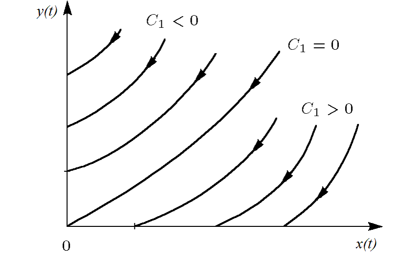

---
## Author
author:
  name: Авдадаев Джамал
  email: 1032230169@rudn.ru
  affiliation:
    - name: Российский университет дружбы народов
      country: Российская Федерация
      postal-code: 117198
      city: Москва
      address: ул. Миклухо-Маклая, д. 6

## Title
title: "Математическое моделирование"
subtitle: "Лабораторная работа № 2"
license: "CC BY"
---

# Цель работы

Рассматриваются основные математические модели вооружённых конфликтов, известные как модели Ланчестера. В таких моделях участвуют две противоборствующие стороны, которые могут представлять как регулярные армии, так и нерегулярные формирования. Ключевой характеристикой каждой стороны является её численность.

Если в некоторый момент времени численность одной из сторон становится равной нулю, то считается, что эта сторона проиграла, при условии, что численность другой стороны остаётся положительной.

# Задание

1. Рассмотреть три варианта моделей Ланчестера.
2. Построить графики изменения численности войск.
3. Определить сторону, одержавшую победу.

# Выполнение лабораторной работы

## Теоретические сведения

Рассмотрим три возможных сценария вооружённого противостояния:

1. столкновение регулярных армий;
2. конфликт между регулярной армией и партизанскими формированиями;
3. противостояние между партизанскими отрядами.

### 1. Бой между регулярными армиями
Численность регулярных войск изменяется под воздействием нескольких факторов:

1. естественные потери, не связанные напрямую с боевыми действиями (болезни, дезертирство, травмы);
2. потери, возникающие в ходе вооружённого противостояния;
3. пополнение за счёт резервов.

В этом случае изменение численности описывается системой дифференциальных уравнений

$$
\begin{cases}
\frac{dx}{dt}= -a(t)x(t) - b(t)y(t) + P(t) \\
\frac{dy}{dt}= -c(t)x(t) - h(t)y(t) + Q(t)
\end{cases}
$$

Слагаемые $-a(t)x(t)$ и $-h(t)y(t)$ соответствуют естественным потерям.  
Члены $-b(t)y(t)$ и $-c(t)x(t)$ отражают потери, вызванные непосредственным воздействием противника.

Коэффициенты $b(t)$ и $c(t)$ характеризуют эффективность боевых действий сторон, тогда как параметры $a(t)$ и $h(t)$ учитывают влияние небойовых факторов. Функции $P(t)$ и $Q(t)$ описывают поступление подкреплений.

### 2. Регулярная армия против партизанских отрядов
Партизанские формирования действуют более скрытно и рассредоточены по территории, поэтому воздействие регулярной армии является менее точечным. Предполагается, что скорость потерь партизан определяется как численностью армии противника, так и их собственной численностью.

Модель описывается следующей системой уравнений:

$$
\begin{cases}
\frac{dx}{dt}= -a(t)x(t) - b(t)y(t) + P(t) \\
\frac{dy}{dt}= -c(t)x(t)y(t) - h(t)y(t) + Q(t)
\end{cases}
$$

### 3. Конфликт между партизанскими отрядами

Если обе стороны действуют как нерегулярные формирования, то интенсивность потерь определяется произведением численностей противников. Тогда система уравнений имеет форму

$$
\begin{cases}
\frac{dx}{dt}= -a(t)x(t) - b(t)x(t)y(t) + P(t) \\
\frac{dy}{dt}= -h(t)y(t) - c(t)x(t)y(t) + Q(t)
\end{cases}
$$

### Упрощённая модель Ланчестера

В простейшем случае предполагается, что коэффициенты боевой эффективности постоянны, а подкрепления и небойовые потери отсутствуют. Тогда система принимает вид

$$
\begin{cases}
\frac{dx}{dt}= -by \\
\frac{dy}{dt}= -ax
\end{cases}
$$

Здесь предполагается, что каждый солдат армии $x$ выводит из строя $c$ солдат армии $y$ за единицу времени, а каждый солдат армии $y$ — $b$ солдат армии $x$.

Делением уравнений получаем

$$
\frac{dx}{dy}=\frac{by}{cx}
$$

После преобразований получаем интеграл движения

$$
cx^2 - by^2 = C
$$

Следовательно, изменение численностей происходит вдоль гипербол, определяемых данным уравнением.

{ #fig:001 width=70% height=70% }

Эти гиперболы разделяются прямой

$$
\sqrt{cx}=\sqrt{by}
$$

Если начальная точка расположена выше этой прямой, то в ходе конфликта численность армии $x$ стремится к нулю и побеждает армия $y$. Если же начальная точка находится ниже линии разделения, победителем становится армия $x$.

В случае расположения начального состояния на самой разделяющей прямой конфликт приводит к взаимному истощению сторон.

Из анализа модели следует важное соотношение: чтобы противостоять противнику, превосходящему по численности в $k$ раз, необходимо иметь вооружение примерно в $k^2$ раз более эффективное.

Несмотря на сильную идеализацию, модель полезна для качественного анализа динамики конфликта.

### Регулярная армия против партизан

При аналогичных упрощениях система принимает вид

$$
\begin{cases}
\frac{dx}{dt}= -by(t) \\
\frac{dy}{dt}= -cx(t)y(t)
\end{cases}
$$

Для неё существует интеграл движения

$$
\frac{b}{2}x^2(t)-cy(t)=C_1
$$

где

$$
C_1=\frac{b}{2}x^2(0)-cy(0)
$$

{ #fig:002 width=70% height=70% }

Из анализа фазовых траекторий следует:

- при $C_1>0$ победу одерживает регулярная армия;
- при $C_1<0$ успех достигают партизанские формирования.

Условие победы регулярной армии можно записать в виде

$$
\frac{b}{2}x^2(0)>cy(0)
$$

Таким образом, для достижения преимущества партизанам требуется значительно увеличивать как свою численность, так и коэффициент эффективности действий.

## Задача

Рассматривается конфликт между странами $X$ и $Y$. Численности армий являются функциями времени $x(t)$ и $y(t)$.

Начальные условия:

- армия страны $X$: 32888 человек;
- армия страны $Y$: 17777 человек.

Предполагается, что коэффициенты $a,b,c,h$ являются постоянными, а функции $P(t)$ и $Q(t)$ непрерывны.

Необходимо построить графики изменения численностей армий для следующих случаев.

### 1. Модель регулярных войск

$$
\begin{cases}
\frac{dx}{dt}= -0.55x(t) - 0.77y(t) + 1.5\sin(3t+1) \\
\frac{dy}{dt}= -0.66x(t) - 0.44y(t) + 1.2\cos(t+1)
\end{cases}
$$

### 2. Модель регулярной армии и партизан

$$
\begin{cases}
\frac{dx}{dt}= -0.27x(t) - 0.88y(t) + \sin(20t) \\
\frac{dy}{dt}= -0.68x(t)y(t) - 0.37y(t) + \cos(10t)
\end{cases}
$$

Для численного моделирования и построения графиков использовались внешние файлы с программным кодом:





## Базовые эксперименты

### Линейная модель (model_type = linear)

На графике представлена эволюция переменных $x(t)$ и $y(t)$ в рамках линейной модели. Обе функции со временем уменьшаются.

Функция $x(t)$ убывает плавно и остаётся положительной на протяжении всего интервала интегрирования. Это свидетельствует о постепенном ослаблении системы без резких скачков.

Функция $y(t)$ уменьшается более быстро и к концу интервала становится близкой к нулю. Подобное поведение характерно для линейных динамических систем, где решения экспоненциально стремятся к устойчивому состоянию.

Таким образом, линейная модель демонстрирует устойчивую и предсказуемую динамику.

### Нелинейная модель (model_type = nonlinear)

Для нелинейной модели характерна иная картина. Переменная $x(t)$ уменьшается значительно медленнее и остаётся достаточно большой на всём временном интервале.

Переменная $y(t)$ практически сразу стремится к нулю. После начального этапа её значение остаётся близким к нулю.

Такой эффект объясняется присутствием нелинейных членов, которые усиливают скорость подавления одной из переменных. В результате динамика системы определяется главным образом функцией $x(t)$.

## Параметрическое сканирование

### Траектории $x(t)$ для различных параметров

Было выполнено исследование влияния параметров модели на траектории решения.

В линейной модели изменялся параметр $a$, а в нелинейной — параметр $a_2$.

Наблюдается следующая закономерность: при увеличении параметра скорость убывания функции $x(t)$ возрастает, что приводит к более быстрому снижению значения переменной.

Основные наблюдения:

- при небольших значениях параметра уменьшение $x(t)$ происходит медленно;
- при увеличении параметра траектории становятся более крутыми;
- различия между кривыми становятся заметными уже на середине временного интервала.

В нелинейной системе влияние параметров сохраняется, однако форма траекторий становится более сложной.

### Траектории $y(t)$ для различных параметров

Аналогичное исследование было выполнено для переменной $y(t)$.

В линейной модели изменение параметров приводит к постепенному изменению формы кривых: при увеличении параметра функция быстрее стремится к нулю.

В нелинейной модели поведение отличается: значение $y(t)$ практически сразу становится близким к нулю вне зависимости от параметра.

Это свидетельствует о доминирующем влиянии нелинейных членов системы.

## Время вычислений

Был проведён анализ времени численного решения системы дифференциальных уравнений при различных параметрах.

Результаты показывают:

- линейная модель вычисляется значительно быстрее;
- время решения линейной системы составляет порядка $10^{-5}$ секунд;
- для нелинейной системы требуется около $7\cdot10^{-4}$–$9\cdot10^{-4}$ секунд.

Несмотря на различия, абсолютное время вычислений остаётся крайне малым.

## Анализ итоговой метрики norm_final

В качестве итоговой характеристики системы использовалась метрика

$$
\text{norm\_final} = \sqrt{x(t_{final})^2 + y(t_{final})^2}
$$

Она отражает величину состояния системы в конце временного интервала.

Анализ показывает:

- при увеличении параметра значение метрики уменьшается;
- линейная модель демонстрирует более быстрое снижение нормы;
- в нелинейной модели значения метрики остаются выше.

Это означает, что линейная система быстрее достигает состояния покоя.

# Выводы

1. Линейная модель характеризуется плавным и предсказуемым уменьшением переменных $x(t)$ и $y(t)$. При этом функция $y(t)$ убывает быстрее.

2. Нелинейная модель демонстрирует качественно иную динамику: переменная $y(t)$ практически мгновенно стремится к нулю, после чего система определяется главным образом функцией $x(t)$.

3. Параметры системы существенно влияют на скорость затухания решений. Их увеличение приводит к более быстрому снижению значений переменных.

4. В нелинейной модели влияние параметров на переменную $y(t)$ оказывается слабым из-за доминирования нелинейных членов.

5. Численные эксперименты показывают, что линейная система решается быстрее, однако даже для нелинейной модели время вычислений остаётся очень малым.

6. Итоговая метрика $\text{norm\_final}$ уменьшается при увеличении параметров, что свидетельствует об усилении затухания динамики системы.

Полученные результаты согласуются с теоретическими ожиданиями для линейных и нелинейных дифференциальных моделей.

# Список литературы {.unnumbered}

1. [Законы Осипова — Ланчестера](https://ru.wikipedia.org/wiki/Законы_Осипова_—_Ланчестера)
2. [Дифференциальные уравнения динамики боя](https://zen.yandex.ru/media/id/5fd3c685994c494848984b63/differencialnye-uravneniia-dinamiki-boia-5fd4bcc45a2c8e1f2cc208f1)
3. [Элементарные модели боя](https://intuit.ru/studies/educational_groups/594/courses/499/lecture/11353?page=7)
